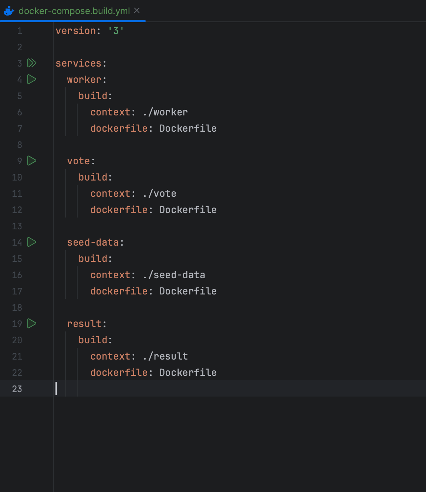
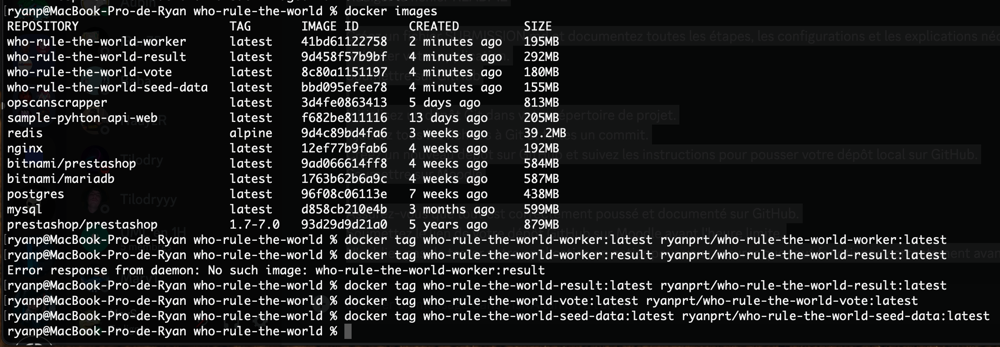
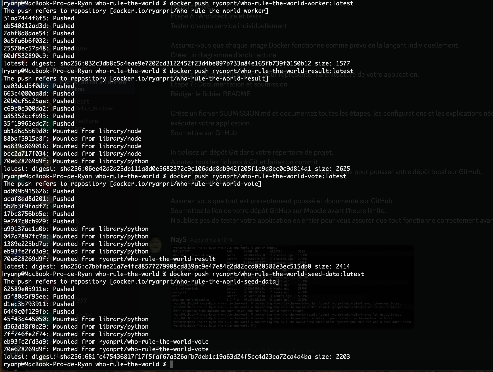
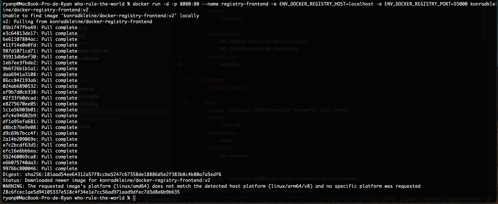
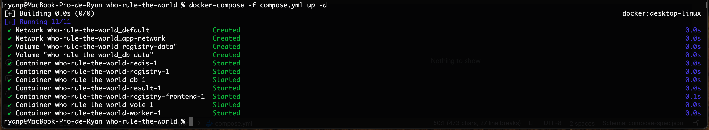
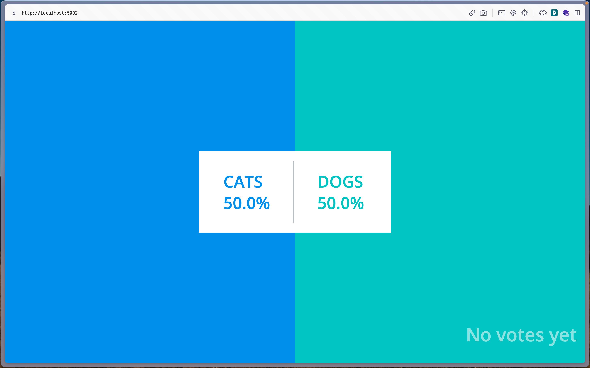
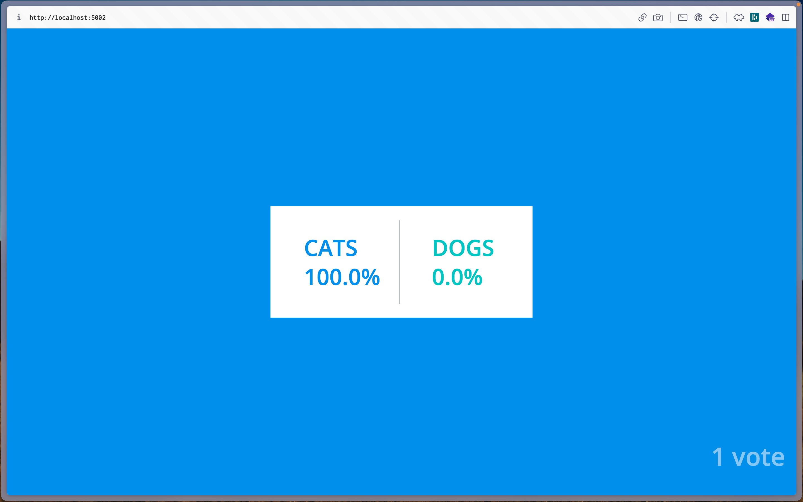

Ce projet n'a pas pu être réalisé sur une machine virtuelle, car nos mac ont rencontré trop de problème lors des tentatives de lancement de VM.

Réalisé par Ryan PEYROT, Lucas SEVAULT et Aubin OLIVRIE

Lien Github: https://github.com/RyanPeyrot/ynov-resources.git

# Who Rule The World: CATs or DOGs ?

Ce fichier est la documentation du lancement de notre application qui tourne sur plusieurs containers Docker.

## Étape 1: Configuration des images Docker

### 1.1. Création du fichier docker-compose.build.yml

Le fichier docker-compose.build.yml définit la configuration pour construire les images Docker nécessaires à partir des sources du projet, facilitant le déploiement dans un environnement conteneurisé.


### 1.2. Construction des images

Avec la commande suivante, on va construire toutes les images nécessaires au fonctionnement de l'application.

```shell
docker-compose -f docker-compose.build.yml build
```

## Étape 2: Création des tags et ajout des images en public

### 2.1. Mise en place d'un registre public

On publie les images dans un registre public, puis on tague chaque image construite avec le nom de notre registre public.



Ensuite, on push les images sur le registre.



### 2.2. Mise en place du registre privé

On publie les images dans un registre privé et on répète le processus de tag et de push pour le registre privé.


### 2.3. Visualisation des registres privés

Avec l'outil de Konrad Kleine `"Docker Registry Frontend"`, on peut visualiser et gérer les images stockées dans un registre Docker par le biais d'une interface web.



Malgré une attention minutieuse à la configuration de cet outil et de nombreux essais, nous n'avons pas réussi à afficher nos registres dans cette interface. Nous avons même essayé d'intégrer la création du registre et du front-end au fichier `compose.yml`, mais cela ne résoud pas le problème.

```yml
registry:
    image: registry:2
    ports:
      - "55000:5000"
    volumes:
      - registry-data:/var/lib/registry

  registry-frontend:
    image: konradkleine/docker-registry-frontend:v2
    platform: linux/amd64
    ports:
      - "8080:80"

    environment:
      - ENV_DOCKER_REGISTRY_HOST=registry
      - ENV_DOCKER_REGISTRY_PORT=55000
    depends_on:
      - registry
```

## Étape 3: Déploiement de l'application

### 3.1. Création du fichier compose.yml
Ce fichier sera similaire au docker-compose.build.yml, mais au lieu de la section `build`, on utilise `image` pour référencer les images de notre registre privé. Dans ce fichier, on déploie toutes les images des containers dans lesquelles on spécifie les volumes ainsi que les network afin que nos applications puissent communiquer entre elles.

```yml
vote:
    image: localhost:5000/who-rule-the-world-vote:latest
    ports:
      - "5001:80"
    depends_on:
      - redis
    networks:
      - app-network

  worker:
    image: localhost:55000/who-rule-the-world-worker:latest
    depends_on:
      - db
      - redis
    networks:
      - app-network

  result:
    image: localhost:55000/who-rule-the-world-result:latest
    ports:
      - "5002:80"
    depends_on:
      - db
    networks:
      - app-network

  redis:
    image: redis:alpine
    networks:
      - app-network

  db:
    image: postgres:13
    volumes:
      - db-data:/var/lib/postgresql/data
    environment:
      POSTGRES_USER: "postgres"
      POSTGRES_PASSWORD: "postgres"
    networks:
      - app-network

networks:
  app-network:
    driver: bridge

volumes:
  db-data:
  registry-data:
```

### 3.2. Création des containers
Enfin, on exécute la commande `docker-compose` pour créer et mettre en route les containers.



### 3.3. Résultat
On atterrit effectivement sur notre sondage.



On fait notre vote...



Les chats ont gagné !